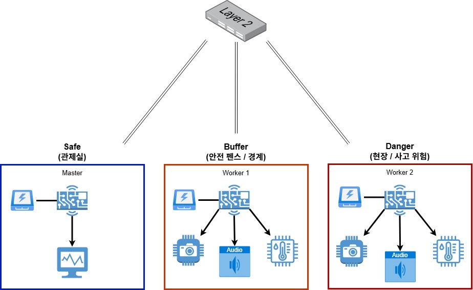
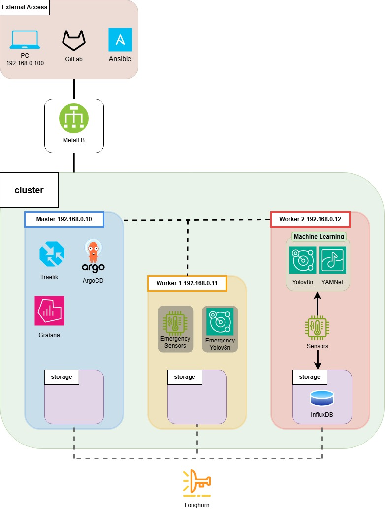

# 🛡️ Safe-Edge Blackbox
### Smart Factory 3-Node HA Edge Orchestration & Data Preservation System

  
  
  
  
  
  

 

> **재난 상황의 데이터 유실(Blackout)을 방지하기 위해 엣지 환경에 최적화된 3-Node 고가용성 클러스터 및 GitOps 자동화 파이프라인 구축 프로젝트입니다.**

---

## 📖 1. Project Overview (프로젝트 개요)

### 🚨 Problem: The Blackout
산업 현장에서 화재나 폭발 사고 발생 시, 현장의 감시 장비가 파손되면 내부 데이터(SD카드 등)도 함께 소실되어 원인 규명이 불가능한 **'Blackout'** 현상이 발생합니다.

### 💡 Solution
본 프로젝트는 'Control Plane(지휘)'과 'Data Plane(현장)'을 물리적으로 분리하고, 사고 직전의 데이터를 안전 구역으로 실시간 복제하는 고가용성 아키텍처를 구현합니다.

* **Control Plane 격리:** 마스터 노드를 연산에서 배제하여 클러스터의 생존성을 극대화합니다.
* **무중단 Failover:** 위험 구역 노드(W2) 파괴 시, 안전 구역 대기 노드(W1)가 즉시 임무를 승계합니다.
* **데이터 이원화:** SSD(Hot)와 NFS(Cold)를 결합한 하이브리드 저장소를 구축합니다.

---

## 🏆 2. Main Contributions (핵심 가치)

### 1. Zero-Loss Data Architecture for Edge (데이터 무손실 아키텍처)
* **이중화 스토리지 (Tiering Strategy):** `Longhorn`의 동기식 복제(Synchronous Replication)를 통해 위험 구역의 데이터를 안전 구역으로 실시간 미러링하여 **RPO(목표 복구 시점) 0초**를 달성.
* **하이브리드 보존:** 엣지의 SSD(Hot Data)와 온프레미스 서버의 HDD(Cold Data)를 결합하여 데이터 보존 기간 비약적 연장.

### 2. High-Availability Edge Orchestration (고가용성 엣지 오케스트레이션)
* **Control Plane 격리:** 리소스가 부족한 엣지 환경(Pi 5 4GB)에서도 `Taint` 설정을 통해 마스터 노드의 부하를 원천 차단하여 클러스터 안정성 확보.
* **초고속 Failover:** 파드 스케줄링 전략(Affinity/Toleration) 최적화를 통해 물리적 파괴 상황에서도 **1분 이내(Target RTO)**에 무중단 감시 체계 자동 승계.

### 3. Cost-Effective DR System (저비용 고효율 DR 시스템)
* **오픈 소스 및 경량 H/W 기반:** 범용 SBC(라즈베리파이)와 `K3s`, `ArgoCD` 등 오픈 소스 기술 스택을 결합하여 고가의 산업용 서버 대비 **90% 이상의 도입 비용 절감**.

---

## ⚖️ 3. 설계상 비협상 조건 (Non-negotiables)

엔터프라이즈급 안정성을 엣지 환경에 구현하기 위해 다음의 설계 원칙을 타협 없이 적용했습니다.

| 설계 항목 | 타협 불가 조건 (결정 사항) | 도입 근거 |
| :--- | :--- | :--- |
| **OS 환경** | GUI 완전 배제 (`Raspberry Pi OS Lite 64-bit`) | 4GB/8GB 엣지 환경에서 K3s 및 AI 컨테이너가 사용할 가용 메모리 극대화 |
| **Control Plane** | Master Node `Taint` 설정 (연산 완전 격리) | K3s 매니저 및 GitOps(ArgoCD) 구동 부하로 인한 OOM 방지 및 클러스터 생존성 확보 |
| **Storage** | SD카드 데이터 쓰기 배제, SSD + Longhorn 구성 | 단일 물리 매체 파괴 시 데이터 유실(SPOF) 방지 및 I/O 병목 해소 |
| **DR / 가용성** | RPO 0초 (미러링), RTO 1분 이내 (승계) | 현장(Danger Zone) 파괴 시에도 안전 구역(Buffer)에 직전 데이터 100% 보존 |

---

## 🏗️ 4. Architecture (인프라 구성도)

시스템은 물리적으로 **Safe Zone, Buffer Zone, Danger Zone**의 3계층으로 구성되며, 각 노드는 Layer 2 Switch로 연결됩니다.

*(※ 하드웨어 배치도 및 3-Tier 아키텍처 다이어그램)*

| Role | Hostname (IP) | Zone | Mission & Specs |
| :--- | :--- | :--- | :--- |
| **Control Plane** | `Master` (192.168.0.10) | **Safe Zone** | Cluster Orchestration & Monitoring (Pi 5 4GB) |
| **Standby Worker** | `Worker-1` (192.168.0.11) | **Buffer Zone** | Hot Standby & Buffer Storage (Pi 5 8GB) |
| **Active Worker** | `Worker-2` (192.168.0.12) | **Danger Zone** | Main Sensing & AI Processing (Pi 5 8GB) |

 

*(※ 인프라스트럭처 및 데이터 파이프라인 흐름도)*

---

## 🗺️ 5. Roadmap & Status (진행 상태)

| Phase | 단계 | 주요 목표 및 작업 내용 | 상태 |
| :---: | :--- | :--- | :---: |
| **Phase 0** | Architecture | 하드웨어 스펙 산정, 3-Tier 네트워크 설계, 다이어그램 도출 | ✅ 완료 |
| **Phase 1** | Foundation | Lite OS 설치, 커널 튜닝(절전/전력 차단 방지), 고정 IP 세팅 | 🟡 진행 중 |
| **Phase 2** | Cluster & Storage | K3s Master/Worker 구성, Longhorn RPO 0초 동기화 세팅 | ⏳ 예정 |
| **Phase 3** | Edge AI & H/W | 비전(YOLO) 및 오디오(YAMNet) 컨테이너 구동, 센서 연동 | ⏳ 예정 |
| **Phase 4** | DevOps & GitOps | Host PC GitLab 연동, ArgoCD 자동 배포 체계(Sync) 구축 | ⏳ 예정 |
| **Phase 5** | DR & Chaos Test | W2 랜선 단절 시뮬레이션 (Failover 승계 및 무결성 검증) | ⏳ 예정 |

---

## 📚 6. Documents & Wiki (작성 예정)

상세한 설계 근거, 아키텍처 문서, 그리고 운영 중 발생한 트러블슈팅 로깅은 별도 문서(Wiki)로 관리합니다.

* **[Architecture Decision Record (ADR)]** - K3s, Longhorn, Lite OS 등 핵심 기술 스택 도입 근거
* **[Disaster Recovery Policy]** - Hot/Cold Data 계층화 보존 전략 및 가용성 보장 정책서
* **[Chaos Engineering Test]** - 위험 구역(W2) 노드 물리적 파괴 시뮬레이션 및 복구 검증 시나리오
* **[Capacity Planning]** - 하드웨어 리소스 스펙 산정 근거
* **[Troubleshooting Log]** - 라즈베리파이 전력 부족(USB Cut-off), SSD 절전 모드 등 인프라 이슈 해결 기록

---
> 💡 *본 문서는 프로젝트 진행 단계에 따라 지속적으로 업데이트됩니다.*
