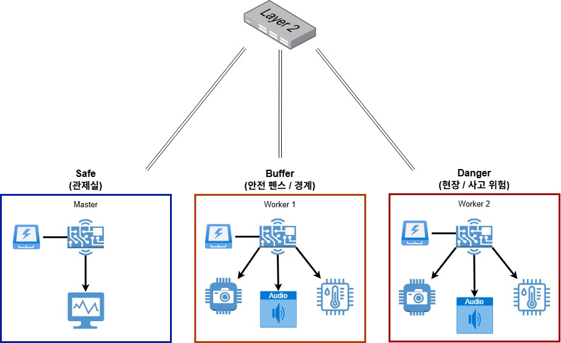
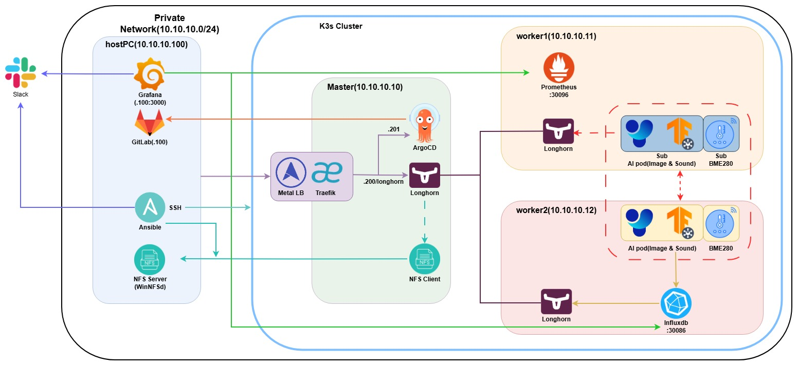

# 🛡️ Safe-Edge Blackbox
### Smart Factory 3-Node HA Edge Orchestration & Data Preservation System

<div align="center">

  
  
  
  
  
  
  
  

</div>

<br>

<div align="center">

| 🎯 RPO | ⚡ RTO | 🖥️ 노드 구성 | 💰 비용 절감 |
|:---:|:---:|:---:|:---:|
| **0초** | **< 2분** | **3-Node HA** | **90%+** |

</div>

<br>

> **재난 상황의 데이터 유실(Blackout)을 방지하기 위해 엣지 환경에 최적화된 3-Node 고가용성 클러스터 및 GitOps 자동화 파이프라인을 구축한 프로젝트입니다.**

---

## 📖 1. Project Overview (프로젝트 개요)

### 🚨 Problem: The Blackout
산업 현장에서 화재나 폭발 사고 발생 시 현장의 감시 장비가 파손되면 내부 데이터도 함께 소실되어 원인 규명이 불가능한 **'Blackout'** 현상이 발생합니다.

### 💡 Solution
본 프로젝트는 비행기 블랙박스 개념을 엣지 환경에 적용하여, **'Control Plane(지휘)'과 'Data Plane(현장)'을 물리적으로 분리**하고 사고 직전의 데이터를 안전 구역으로 실시간 복제하는 고가용성 아키텍처를 구현합니다.

- **Control Plane 격리:** 마스터 노드를 연산에서 배제하여 클러스터의 생존성을 극대화합니다.
- **무중단 Failover:** 위험 구역 노드(W2) 파괴 시 안전 구역 대기 노드(W1)가 즉시 임무를 승계합니다.
- **데이터 이원화:** SSD(Hot)와 NFS(Cold)를 결합한 하이브리드 저장소를 구축합니다.

---

## 🏆 2. Main Contributions (핵심 가치)

### 1. Zero-Loss Data Architecture for Edge (데이터 무손실 아키텍처)
- **이중화 스토리지 (Tiering Strategy):** `Longhorn`의 동기식 복제(Synchronous Replication)를 통해 위험 구역의 데이터를 안전 구역으로 실시간 미러링하여 **RPO(목표 복구 시점) 0초** 달성.
- **하이브리드 보존:** 엣지의 SSD(Hot Data, 최근 5시간)와 온프레미스 서버의 HDD(Cold Data)를 결합한 Store-and-Forward 파이프라인으로 데이터 보존 기간 비약적 연장.

### 2. High-Availability Edge Orchestration (고가용성 엣지 오케스트레이션)
- **Control Plane 격리:** 리소스가 부족한 엣지 환경(Pi 5 4GB)에서도 `Taint` 설정을 통해 마스터 노드의 부하를 원천 차단하여 클러스터 안정성 확보.
- **초고속 Failover:** 파드 스케줄링 전략(Node Affinity + Toleration 30초) 최적화를 통해 물리적 파괴 상황에서도 **1분 이내(Target RTO)** 에 무중단 감시 체계 자동 승계.

### 3. Cost-Effective DR System (저비용 고효율 DR 시스템)
- **오픈 소스 및 경량 H/W 기반:** 범용 SBC(라즈베리파이)와 `K3s`, `ArgoCD` 등 오픈 소스 기술 스택을 결합하여 고가의 산업용 서버 대비 **90% 이상의 도입 비용 절감**.

---

## 🧱 3. Tech Stack (기술 스택)

| 분류 | 기술 | 선택 이유 |
|:---|:---|:---|
| **Container Orchestration** | K3s (latest) | ARM64 엣지 환경에 최적화된 경량 쿠버네티스 |
| **Distributed Storage** | Longhorn | 동기식 복제로 RPO 0초 달성, 노드 파괴 시 데이터 보존 |
| **GitOps** | ArgoCD + GitLab | 선언적 배포로 인프라 상태를 Git이 단일 진실 원천(SSOT)으로 관리 |
| **Time-Series DB** | InfluxDB 1.8 (arm64v8) | AI/센서 감지 데이터의 시계열 저장 및 Grafana 연동 |
| **Monitoring** | Prometheus + Grafana | 전 노드 메트릭 수집 및 3단계 Slack 알람 |
| **AI Inference** | YOLO + YAMNet | 화재/자세 감지(영상) + 이상 소음 감지(오디오) |
| **Load Balancer** | MetalLB + Traefik | 베어메탈 환경의 외부 IP 할당 및 Ingress 라우팅 |
| **IaC** | Ansible | 전 노드 설정 자동화 (네트워크, NFS, 티어링, 헬스체크) |
| **OS** | Raspberry Pi OS Lite 64-bit | GUI 배제로 K3s 및 AI 컨테이너 가용 메모리 극대화 |

> 📚 기술 선택 상세 근거 → [Architecture Decision Record (ADR)](https://github.com/msp-architect-2026/kim-minsoo/wiki/Architecture-Decision-Record)

---

## 🏗️ 4. Architecture (인프라 구성도)

시스템은 물리적으로 **Safe Zone, Buffer Zone, Danger Zone**의 3계층으로 구성되며, 각 노드는 Layer 2 Switch로 연결됩니다.



| Role | Hostname (IP) | Zone | Mission & Specs |
|:---|:---|:---|:---|
| **Control Plane** | `Master` (10.10.10.10) | **Safe Zone** | Cluster Orchestration, ArgoCD, Monitoring (Pi 5 4GB) |
| **Standby Worker** | `Worker-1` (10.10.10.11) | **Buffer Zone** | Hot Standby, Longhorn Replica, Data Tiering (Pi 5 8GB) |
| **Active Worker** | `Worker-2` (10.10.10.12) | **Danger Zone** | AI 추론, 센서 수집, InfluxDB (Pi 5 8GB) |
| **Host PC** | `Windows` (10.10.10.100) | **Safe Zone** | NFS Cold Storage, GitLab, Grafana, Ansible (클러스터 외부) |

<br>



> 📚 상세 아키텍처 설명 → [Wiki: Project Overview](https://github.com/msp-architect-2026/kim-minsoo/wiki/Project%E2%80%90Overview)

---

## ⚖️ 5. 설계상 비협상 조건 (Non-negotiables)

| 설계 항목 | 결정 사항 | 도입 근거 |
|:---|:---|:---|
| **OS 환경** | GUI 완전 배제 (Raspberry Pi OS Lite 64-bit) | 4GB/8GB 엣지 환경에서 K3s 및 AI 컨테이너 가용 메모리 극대화 |
| **Control Plane** | Master Node `Taint` 설정 (연산 완전 격리) | OOM 방지 및 클러스터 생존성 확보 |
| **Storage** | SD카드 쓰기 배제, SSD + Longhorn 구성 | 단일 물리 매체 파괴 시 SPOF 방지 및 I/O 병목 해소 |
| **DR / 가용성** | RPO 0초 (미러링), RTO 1분 이내 (승계) | Danger Zone 파괴 시에도 Buffer Zone에 직전 데이터 100% 보존 |
| **네트워크** | 이더넷(클러스터 전용) / Wi-Fi(인터넷) 물리 분리 | 사내망 DHCP 충돌 원천 차단 |

> 📚 상세 DR 정책 → [Wiki: Disaster Recovery & Availability Policy](https://github.com/msp-architect-2026/kim-minsoo/wiki/Disaster-Recovery-&-Availability-Policy)

---

## 🔄 6. 시스템 동작 흐름

### 정상 상태
```
센서/카메라/마이크 (Worker2)
  → AI 파드 (YOLO/YAMNet/BME280) 감지
  → InfluxDB :30086 저장 (Longhorn PV로 영속화)
  → Grafana (Host PC :3000) 실시간 시각화
  → Prometheus :30090 노드 메트릭 수집
```

### Failover 발생 시 (Worker2 파괴)
```
Worker2 다운 감지 (kube_node_status_condition)
  → Grafana Alert → Slack 알람 🚨
  → Node Affinity로 AI 파드 → Worker1 자동 이동 (30초)
  → auto_failback.sh (1분마다) → Worker2 복구 시 자동 원복 ✅
```

### 데이터 티어링 (Hot → Cold)
```
InfluxDB Hot Data (최근 5시간 보존)
  → run_tiering.sh (매시 정각) → CSV 추출
  → nfs-ready (로컬 버퍼) → nfs-complete (NFS 마운트)
  → Host PC NFS Cold Storage (C:\safe-edge-nfs) 영구 보존
  + run_photo_tiering.sh (10분마다) → AI 파드 스냅샷 회수
```

> 📚 상세 티어링 전략 → [Wiki: Disaster Recovery & Availability Policy](https://github.com/msp-architect-2026/kim-minsoo/wiki/Disaster-Recovery-&-Availability-Policy)

---

## 🗺️ 7. Roadmap & Status

| Phase | 단계 | 주요 작업 내용 | 상태 |
|:---:|:---|:---|:---:|
| **Phase 0** | Architecture | 하드웨어 스펙 산정, 3-Tier 네트워크 설계, 독립망(10.10.10.x) 구성 | ✅ 완료 |
| **Phase 1** | Foundation | Lite OS 설치, 고정 IP 세팅, K3s 3-Node 클러스터 구성, MetalLB + Traefik | ✅ 완료 |
| **Phase 2** | Cluster & Storage | Longhorn 3-Node HA 구성 (RPO 0초), ArgoCD GitOps 파이프라인 | ✅ 완료 |
| **Phase 3** | Edge AI & H/W | YOLO/YAMNet/BME280 컨테이너 배포, InfluxDB + Grafana 시각화 | ✅ 완료 |
| **Phase 4** | DevOps & GitOps | GitLab 연동, ArgoCD Auto Sync, Prometheus 알람, Slack Webhook | ✅ 완료 |
| **Phase 5** | IaC & Tiering | Ansible 5개 Playbook, Hot→Cold 데이터 티어링, Failover/Failback 자동화 | ✅ 완료 |

---

## 🔥 8. Key Troubleshooting (핵심 트러블슈팅)

실제 구현 과정에서 겪은 수십 개의 이슈 중 아키텍처 설계에 직접적인 영향을 준 3가지를 소개합니다.

---

### 🔴 Issue 1. 사내망 DHCP 충돌 및 MetalLB/Klipper 이중 설치
`2026.02.25` `Network` `LoadBalancer`

**증상:** MetalLB 설치 후 `controller` 파드가 `CrashLoopBackOff`, 노드 간 ping이 `137ms → 959ms`로 주기적으로 폭주.

**원인:** 두 가지 복합 원인이었습니다.
- 사내망 DHCP가 노드 고정 IP(`192.168.0.x`)와 동일 대역에서 충돌 → **ARP Storm 발생**
- K3s 기본 내장 Klipper ServiceLB가 활성화된 상태에서 MetalLB를 추가 설치 → **로드밸런서 권한 충돌**

**해결:** 클러스터 전용 독립망(`10.10.10.x/24`)으로 대역 자체를 분리하고, K3s 재설치 시 `--disable servicelb` 옵션으로 Klipper를 원천 차단.

```bash
curl -sfL https://get.k3s.io | sh -s - \
  --node-ip 10.10.10.10 \
  --flannel-iface eth0 \
  --disable servicelb
```

**교훈:** 베어메탈 클러스터는 설치 전에 네트워크 대역, DHCP 충돌 여부, LB 선택을 먼저 확정해야 한다.

> 📚 상세 분석 → [Wiki: Troubleshooting Log](https://github.com/msp-architect-2026/kim-minsoo/wiki/Troubleshooting-&-Operations-Log)

---

### 🟡 Issue 2. Longhorn 3-Node HA 구성 중 Master 노드 `Ready=False`
`2026.02.26` `Storage` `Longhorn`

**증상:** Master 노드에 Longhorn `Taint Toleration`을 부여했으나 `manager` 파드만 누락되며 `Ready: False` 고착.

**원인:** 전역 Toleration 패치로 CSI, engine-image 등 하위 파드들은 Master에 진입했지만, **정작 이들을 관리해야 할 `longhorn-manager` DaemonSet 자체에 Toleration이 누락**되는 '닭과 알의 문제' 발생.

**해결:** `longhorn-manager` DaemonSet에 직접 Toleration을 패치. 실행 후 **6초 만에** 3-Node HA 완성.

```bash
kubectl patch ds longhorn-manager -n longhorn-system \
  -p '{"spec":{"template":{"spec":{"tolerations":[
    {"key":"node-role.kubernetes.io/master",
     "operator":"Equal","value":"true","effect":"NoSchedule"}
  ]}}}}'
```

**교훈:** 꼬인 리소스는 억지로 살리기보다 Clean Reinstall 후 정확한 타겟에 CLI 패치가 가장 빠르다.

> 📚 상세 분석 → [Wiki: Troubleshooting Log](https://github.com/msp-architect-2026/kim-minsoo/wiki/Troubleshooting-&-Operations-Log)

---

### 🔵 Issue 3. K3s CronJob `context deadline exceeded` 및 CPU 1291% 폭주
`2026.03.05` `CronJob` `NFS` `Data Tiering`

**증상:** 데이터 티어링용 CronJob 배포 직후 파드가 `CreateContainerError`로 무한 실패, Master 노드 CPU Load가 **1291%** 까지 폭주.

**원인:** CronJob 볼륨이 WinNFSd 마운트 경로(`hostPath`)를 사용하는 구조였는데, containerd가 컨테이너 생성 시 NFS 마운트 타임아웃(`context deadline exceeded`) 발생 → containerd 내부 DB에 **유령 이름 예약 레코드** 생성 → 재시도 시 이름 충돌 무한 반복.

**해결:** K3s CronJob을 포기하고 아키텍처 자체를 전환. 리눅스 crontab에서 Python 스크립트를 직접 실행하는 방식으로 컨테이너 생성 오버헤드를 제거.

```
[기존] K3s CronJob → 매번 컨테이너 생성 → NFS 마운트 타임아웃
[변경] 리눅스 crontab → Host에서 Python 직접 실행 → 컨테이너 생성 없음
```

**교훈:** 클라우드 네이티브 정석(CronJob)이 리소스 제한적인 엣지 환경에서는 독이 될 수 있다. 환경의 제약을 먼저 고려해야 한다.

> 📚 상세 분석 → [Wiki: Troubleshooting Log](https://github.com/msp-architect-2026/kim-minsoo/wiki/Troubleshooting-&-Operations-Log)

---

## 📚 9. Documents & Wiki

상세한 설계/운영 문서는 **[GitHub Wiki](https://github.com/msp-architect-2026/kim-minsoo/wiki/Home)** 에서 관리합니다.

| 문서 | 내용 | 바로가기 |
|:---|:---|:---|
| 🏠 **Wiki 홈** | 전체 문서 목차 및 네비게이션 | [이동](https://github.com/msp-architect-2026/kim-minsoo/wiki/Home) |
| 🎯 **프로젝트 개요** | Problem/Solution 상세, 3-Tier 아키텍처 설명 | [이동](https://github.com/msp-architect-2026/kim-minsoo/wiki/Project%E2%80%90Overview) |
| 🧱 **기술 스택** | 각 기술 선택 이유 및 버전 명세 | [이동](https://github.com/msp-architect-2026/kim-minsoo/wiki/tech%E2%80%90stack) |
| 🏛️ **기술 선택 근거 (ADR)** | 주요 아키텍처 결정 및 트레이드오프 분석 | [이동](https://github.com/msp-architect-2026/kim-minsoo/wiki/Architecture-Decision-Record) |
| 🛡️ **재해 복구 & 가용성 정책** | RPO/RTO 달성 방법, Failover/Failback 상세, 티어링 전략 | [이동](https://github.com/msp-architect-2026/kim-minsoo/wiki/Disaster-Recovery-&-Availability-Policy) |
| 📊 **용량 계획 & 하드웨어 스펙** | 노드별 리소스 계획, 스토리지 용량 설계 | [이동](https://github.com/msp-architect-2026/kim-minsoo/wiki/Capacity-Planning-&-Hardware-Specs) |
| 🔨 **트러블슈팅 로그** | 전체 이슈 상세 분석 및 해결 과정 | [이동](https://github.com/msp-architect-2026/kim-minsoo/wiki/Troubleshooting-&-Operations-Log) |

---

## 💡 10. What I Learned (배운 점)

이 프로젝트를 통해 단순히 기술을 사용하는 것을 넘어 **"왜 이렇게 설계해야 하는가"** 를 몸으로 익혔습니다.

- **베어메탈은 클라우드가 당연하게 해주던 것을 직접 해야 한다.** LoadBalancer IP 할당, 네트워크 대역 설계, 스토리지 복제 설정까지 모든 레이어를 직접 다루면서 클라우드가 추상화해주던 복잡성을 실감했습니다.

- **엣지 환경에서 클라우드 네이티브 정석은 독이 될 수 있다.** CronJob → crontab 전환처럼, 교과서적 방법이 제한적인 리소스 환경에서는 오히려 장애를 만든다는 것을 직접 겪었습니다.

- **트러블슈팅은 증상이 아닌 근본 원인을 향해야 한다.** `failed to reserve container name`이라는 에러만 봤다면 영원히 해결 못했을 겁니다. 그 이전에 왜 `context deadline exceeded`가 발생했는지를 거슬러 올라가는 습관이 핵심이었습니다.

- **설계 원칙을 타협하지 않는 것이 결국 빠른 길이다.** Longhorn 2-Node로 타협할 뻔했지만 3-Node를 포기하지 않고 끝까지 파고든 결과, DaemonSet 꼬임이라는 진짜 원인을 발견할 수 있었습니다.

---

<div align="center">
  <sub>Built with 🔥 on Raspberry Pi 5 | Completed 2026.03.12</sub>
</div>
