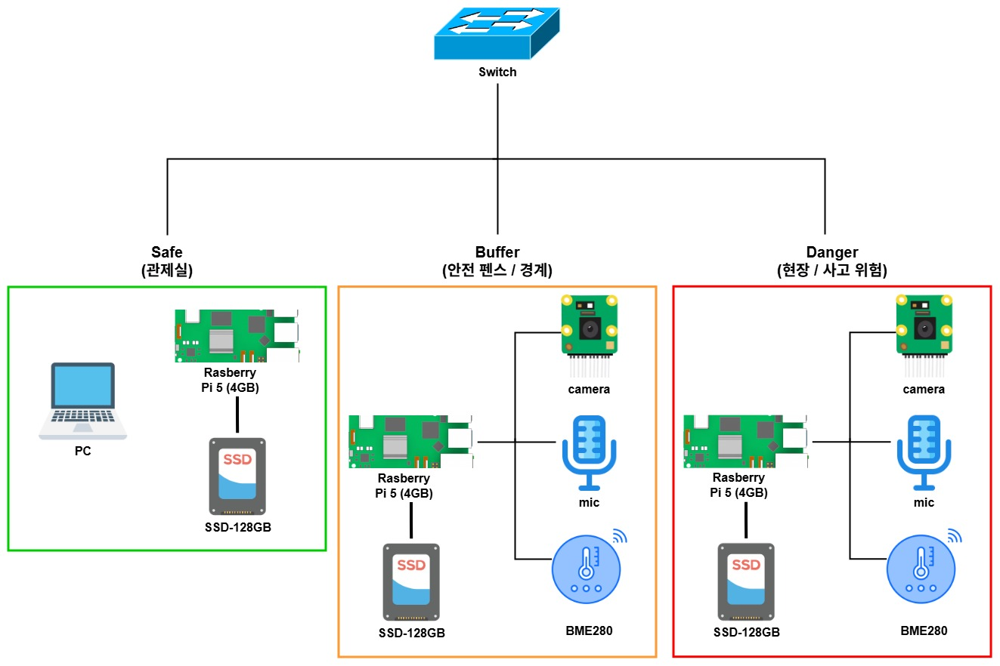

# 🛡️ Safe-Edge Blackbox
### Smart Factory 3-Node HA Edge Orchestration & Data Preservation System

<div align="center">

  
  
  
  
  
  
  
  

</div>

<br>

<div align="center">

| 🎯 RPO | ⚡ RTO | 🖥️ 노드 구성 |
|:---:|:---:|:---:|
| **0초** | **< 2분** | **3-Node HA** |

</div>

<br>

> **재난 상황의 데이터 유실(Blackout)을 방지하기 위해 엣지 환경에 최적화된 3-Node 고가용성 클러스터 및 GitOps 자동화 파이프라인을 구축한 프로젝트입니다.**

> 상세한 설계/운영 문서는 **[GitHub Wiki](https://github.com/msp-architect-2026/kim-minsoo/wiki/Home)** 에서 관리합니다.

> 설계 및 개발 과정의 이슈는 **[GitHub Project](https://github.com/orgs/msp-architect-2026/projects/16/views/1)** 에서 관리합니다.

---

## 📖 1. Project Overview (프로젝트 개요)

### 🚨 Problem: The Blackout
산업 현장에서 화재나 폭발 사고 발생 시 현장의 감시 장비가 파손되면 내부 데이터도 함께 소실되어 원인 규명이 불가능한 **'Blackout'** 현상이 발생합니다.

### 💡 Solution
본 프로젝트는 비행기 블랙박스 개념을 엣지 환경에 적용하여, **'Control Plane(지휘)'과 'Data Plane(현장)'을 물리적으로 분리**하고 사고 직전의 데이터를 안전 구역으로 실시간 복제하는 고가용성 아키텍처를 구현합니다.

- **Control Plane 격리:** 마스터 노드를 연산에서 배제하여 클러스터의 생존성을 극대화합니다.
- **무중단 Failover:** 위험 구역 노드(W2) 파괴 시 안전 구역 대기 노드(W1)가 즉시 임무를 승계합니다.
- **데이터 이원화:** SSD(Hot)와 NFS(Cold)를 결합한 하이브리드 저장소를 구축합니다.

---

## 🏆 2. Main Contributions (핵심 가치)

### 1. Zero-Loss Data Architecture for Edge (데이터 무손실 아키텍처)
- **이중화 스토리지 (Tiering Strategy):** `Longhorn`의 동기식 복제(Synchronous Replication)를 통해 위험 구역의 데이터를 안전 구역으로 실시간 미러링하여 **RPO(목표 복구 시점) 0초** 달성.
- **하이브리드 보존:** 엣지의 SSD(Hot Data, 최근 5시간)와 온프레미스 서버의 HDD(Cold Data)를 결합한 Store-and-Forward 파이프라인으로 데이터 보존 기간 비약적 연장.

### 2. High-Availability Edge Orchestration (고가용성 엣지 오케스트레이션)
- **Control Plane 격리:** 리소스가 부족한 엣지 환경(Pi 5 4GB)에서도 `Taint` 설정을 통해 마스터 노드의 부하를 원천 차단하여 클러스터 안정성 확보.
- **초고속 Failover:** 파드 스케줄링 전략(Node Affinity + Toleration 30초) 최적화를 통해 물리적 파괴 상황에서도 **2분 이내(Target RTO)** 에 무중단 감시 체계 자동 승계.

### 3. Cost-Effective DR System (저비용 고효율 DR 시스템)
- **오픈 소스 및 경량 H/W 기반:** 범용 SBC(라즈베리파이)와 `K3s`, `ArgoCD` 등 오픈 소스 기술 스택을 결합하여 고가의 산업용 서버 대비 **90% 이상의 도입 비용 절감**.

---

## 🧱 3. Tech Stack (기술 스택)

| 분류 | 기술 | 선택 이유 |
|:---|:---|:---|
| **OS & Computing** | Raspberry Pi OS Lite 64-bit | GUI(그래픽 스택)를 완전 배제하여 부팅 오버헤드를 없애고, Master 노드(4GB)의 K3s 및 AI 컨테이너 가용 메모리를 극대화 |
| **Container Orchestration** | K3s (latest) | ARM64 엣지 환경에 최적화된 경량 쿠버네티스. 단일 바이너리로 구동되어 OOM을 방지하며, `tolerationSeconds` 튜닝을 통해 30초 내 Failover 달성 |
| **Distributed Storage** | 외장 SSD + Longhorn (3-Node) | 동기식 미러링으로 RPO 0초 달성. Danger Zone(W2) 파괴 시에도 Safe/Buffer Zone 양쪽에 데이터를 보존하는 이중 안전망 구축 |
| **Network & Ingress** | MetalLB + Traefik | 폐쇄망 베어메탈 환경에서 클라우드 LB 없이 L2 기반 VIP(가상 IP) 할당. K3s 내장 Traefik을 그대로 활용해 리소스 낭비 최소화 |
| **GitOps** | ArgoCD + GitLab + Helm | 선언적 배포로 인프라 상태를 Git이 단일 진실 원천(SSOT)으로 관리. Helm Chart를 도입해 복잡한 배포 설정을 `values.yaml` 하나로 통합 제어 |
| **Time-Series DB** | InfluxDB 1.8 (arm64v8) | AI 이진 감지값(0/1) 및 센서 시계열 데이터 저장. RDBMS 대비 압도적인 쓰기 성능을 제공하며 라즈베리파이 공식 아키텍처 지원 |
| **Monitoring & Alert** | Prometheus + Grafana | 클러스터 메트릭 및 센서 데이터 통합 시각화. Alert Rules를 활용해 장애 발생→Failover→복구 전 과정을 추적하는 무인 3단계 Slack 알람 구현 |
| **AI Inference** | YOLOv8 + YAMNet | 시각(화재/자세)과 청각(이상 소음)을 결합한 멀티모달 구조. 현장 노이즈나 단순 데시벨 임계치의 한계를 극복하고 오탐율(False Positive) 최소화 |
| **IaC (운영 자동화)** | Ansible | 3대의 라즈베리파이 노드 설정(고정 IP, NFS 마운트, 티어링 스크립트, 헬스체크)을 수동 개입 없이 멱등성을 보장하며 일괄 자동화 |
| **Data Tiering** | 리눅스 crontab | K3s CronJob의 NFS 타임아웃 및 CrashLoopBackOff 이슈를 해결. OS 레벨에서 `NFS_CONNECTED`를 확인하는 Store-and-Forward 방식 구현 |
| **Security** | 물리적 망분리 + IP 접근 통제 | L2 사설망(`10.10.10.x`)으로 외부 인터넷 노출 원천 차단. SSH 및 관리 도구 접근을 허가된 Host PC(`10.10.10.100`)로만 엄격히 제한 |

> 📚 기술 선택 상세 근거 → [Architecture Decision Record (ADR)](https://github.com/msp-architect-2026/kim-minsoo/wiki/Architecture-Decision-Record)

---

## 🏗️ 4. Architecture (인프라 구성도)

시스템은 물리적으로 **Safe Zone, Buffer Zone, Danger Zone**의 3계층으로 구성되며, 각 노드는 Layer 2 Switch로 연결됩니다.



| Role | Hostname (IP) | Zone | Mission & Specs |
|:---|:---|:---|:---|
| **Control Plane** | `Master` (10.10.10.10) | **Safe Zone** | Cluster Orchestration, ArgoCD, Monitoring (Pi 5 4GB) |
| **Standby Worker** | `Worker-1` (10.10.10.11) | **Buffer Zone** | Hot Standby, Longhorn Replica, Data Tiering (Pi 5 8GB) |
| **Active Worker** | `Worker-2` (10.10.10.12) | **Danger Zone** | AI 추론, 센서 수집, InfluxDB (Pi 5 8GB) |
| **Host PC** | `Windows` (10.10.10.100) | **Safe Zone** | NFS Cold Storage, GitLab, Grafana, Ansible (클러스터 외부) |

<br>


> 📚 상세 아키텍처 설명 → [Wiki: Project Overview](https://github.com/msp-architect-2026/kim-minsoo/wiki/Project%E2%80%90Overview)

---

## ⚖️ 5. 설계상 비협상 조건 (Non-negotiables)

| 설계 항목 | 결정 사항 | 도입 근거 |
|:---|:---|:---|
| **OS 환경** | GUI 완전 배제 (Raspberry Pi OS Lite 64-bit) | 4GB/8GB 엣지 환경에서 K3s 및 AI 컨테이너 가용 메모리 극대화 |
| **Control Plane** | Master Node `Taint` 설정 (연산 완전 격리) | OOM 방지 및 클러스터 생존성 확보 |
| **Storage** | SD카드 쓰기 배제, SSD + Longhorn 구성 | 단일 물리 매체 파괴 시 SPOF 방지 및 I/O 병목 해소 |
| **DR / 가용성** | RPO 0초 (미러링), RTO 2분 이내 (승계) | Danger Zone 파괴 시에도 Buffer Zone에 직전 데이터 100% 보존 |
| **네트워크** | 이더넷(클러스터 전용) / Wi-Fi(인터넷) 물리 분리 | 사내망 DHCP 충돌 원천 차단 |

> 📚 상세 DR 정책 → [Wiki: Disaster Recovery & Availability Policy](https://github.com/msp-architect-2026/kim-minsoo/wiki/Disaster-Recovery-&-Availability-Policy)

---

## 🔄 6. 시스템 동작 흐름

### 정상 상태
```
센서/카메라/마이크 (Worker2)
  → AI 파드 (YOLO/YAMNet/BME280) 감지
  → InfluxDB :30086 저장 (Longhorn PV로 영속화)
  → Grafana (Host PC :3000) 실시간 시각화
  → Prometheus :30090 노드 메트릭 수집
```

### Failover 발생 시 (Worker2 파괴)
```
Worker2 다운 감지 (kube_node_status_condition)
  → Grafana Alert → Slack 알람 🚨
  → Node Affinity로 AI 파드 → Worker1 자동 이동 (30초)
  → auto_failback.sh (1분마다) → Worker2 복구 시 자동 원복 ✅
```

### 데이터 티어링 (Hot → Cold)
```
InfluxDB Hot Data (최근 5시간 보존)
  → run_tiering.sh (매시 정각) → CSV 추출
  → nfs-ready (로컬 버퍼) → nfs-complete (NFS 마운트)
  → Host PC NFS Cold Storage (C:\safe-edge-nfs) 영구 보존
  + run_photo_tiering.sh (10분마다) → AI 파드 스냅샷 회수
```

> 📚 상세 티어링 전략 → [Wiki: Disaster Recovery & Availability Policy](https://github.com/msp-architect-2026/kim-minsoo/wiki/Disaster-Recovery-&-Availability-Policy)

---

## 🗺️ 7. Roadmap & Status

| Phase | 단계 | 주요 작업 내용 | 상태 |
|:---:|:---|:---|:---:|
| **Phase 0** | Architecture | 하드웨어 스펙 산정, 3-Tier 네트워크 설계, 독립망(10.10.10.x) 구성 | ✅ 완료 |
| **Phase 1** | Foundation | Lite OS 설치, 고정 IP 세팅, K3s 3-Node 클러스터 구성, MetalLB + Traefik | ✅ 완료 |
| **Phase 2** | Cluster & Storage | Longhorn 3-Node HA 구성 (RPO 0초), ArgoCD GitOps 파이프라인 | ✅ 완료 |
| **Phase 3** | Edge AI & H/W | YOLO/YAMNet/BME280 컨테이너 배포, InfluxDB + Grafana 시각화 | ✅ 완료 |
| **Phase 4** | DevOps & GitOps | GitLab 연동, ArgoCD Auto Sync, Prometheus 알람, Slack Webhook | ✅ 완료 |
| **Phase 5** | IaC & Tiering | Ansible 5개 Playbook, Helm Chart 기반 GitOps 배포, Hot→Cold 데이터 티어링, Failover/Failback 자동화 | ✅ 완료 |

---

## 📚 8. Documents & Wiki

상세한 설계/운영 문서는 **[GitHub Wiki](https://github.com/msp-architect-2026/kim-minsoo/wiki/Home)** 에서 관리합니다.

| 문서 | 내용 | 바로가기 |
|:---|:---|:---|
| 🏠 **Wiki 홈** | 전체 문서 목차 및 네비게이션 | [이동](https://github.com/msp-architect-2026/kim-minsoo/wiki/Home) |
| 🎯 **프로젝트 개요** | Problem/Solution 상세, 3-Tier 아키텍처 설명 | [이동](https://github.com/msp-architect-2026/kim-minsoo/wiki/Project%E2%80%90Overview) |
| 🧱 **기술 스택** | 각 기술 선택 이유 및 버전 명세 | [이동](https://github.com/msp-architect-2026/kim-minsoo/wiki/tech%E2%80%90stack) |
| 🏛️ **기술 선택 근거 (ADR)** | 주요 아키텍처 결정 및 트레이드오프 분석 | [이동](https://github.com/msp-architect-2026/kim-minsoo/wiki/Architecture-Decision-Record) |
| 🛡️ **재해 복구 & 가용성 정책** | RPO/RTO 달성 방법, Failover/Failback 상세, 티어링 전략 | [이동](https://github.com/msp-architect-2026/kim-minsoo/wiki/Disaster-Recovery-&-Availability-Policy) |
| 📊 **용량 계획 & 하드웨어 스펙** | 노드별 리소스 계획, 스토리지 용량 설계 | [이동](https://github.com/msp-architect-2026/kim-minsoo/wiki/Capacity-Planning-&-Hardware-Specs) |
| 🔨 **트러블슈팅 로그** | 전체 이슈 상세 분석 및 해결 과정 | [이동](https://github.com/msp-architect-2026/kim-minsoo/wiki/Troubleshooting-&-Operations-Log) |

---

